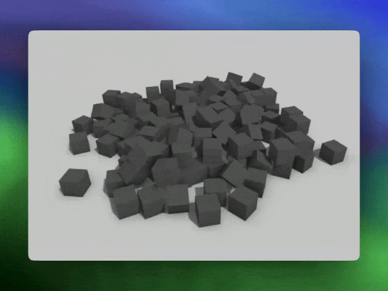

# **Draggable RigidBody Component**

A flexible drag-and-drop component for **pmndrs/drei** + **react-three-rapier**



## **Features**

- **Drag-and-Drop Physics:** Implements realistic, physics-based dragging behavior using `react-three-rapier` physics engine and `DragControls` from `pmndrs/drei`
- **Customizable Bounding Box:** Restrict object movement within defined boundaries.
- **Wobbly effect** Optional spring joints provide "wobbly" effects for objects during and after drag events.
- **Invisible Mesh for Control:** Uses a hidden mesh to improve the precision and fluidity of dragging.
- **Flexible Configuration:** Easily configurable parameters for drag limits, joint stiffness, damping, and more.

---

## **Installation**

Simply download and import `DraggableRigidBody.tsx` and `CustomDragControls.tsx` into your project

# IMPORTANT

The component utilizes a modified version of [DragControls](https://drei.docs.pmnd.rs/gizmos/drag-controls#dragcontrols) that fixes overlaps (check [this issue](https://github.com/pmndrs/drei/issues/2097) and [this PR](https://github.com/pmndrs/drei/pull/2098) for additional info)

```tsx
const DraggableRigidBodyProps: Partial<DraggableRigidBodyProps> = {
  dragControlsProps: {
    preventOverlap: true,
  },
};
```

## **Usage**

Here's an example of how you can use the `DraggableRigidBody` component in your React Three Fiber scene:

```tsx
function MyScene() {
  const DraggableRigidBodyProps: Partial<DraggableRigidBodyProps> = {
    rigidBodyProps: {
      gravityScale: 3.5,
      linearDamping: 5,
      angularDamping: 0.2,
    },
    boundingBox: [
      [-8, 8],
      [0.5, 8],
      [-8, 8],
    ],
    dragControlsProps: {
      preventOverlap: true,
    },
  };

  return (
    <Canvas>
      <Physics>
        <DraggableRigidBody
          {...DraggableRigidBodyProps}
          visibleMesh={
            <mesh castShadow receiveShadow>
              <boxGeometry args={[1, 1, 1]} />
              <meshStandardMaterial color={"gray"} wireframe={false} />
            </mesh>
          }
        />
      </Physics>
    </Canvas>
  );
}
```

### **Props**

| Prop Name           | Type                                                             | Description                                                                                                                                                       |
| ------------------- | ---------------------------------------------------------------- | ----------------------------------------------------------------------------------------------------------------------------------------------------------------- |
| `visibleMesh`       | `ReactElement<ThreeElements['mesh']>`                            | The mesh visible in the scene.                                                                                                                                    |
| `groupProps`        | `GroupProps`                                                     | Set position, rotation.                                                                                                                                           |
| `boundingBox`       | `[[number, number], ...]`                                        | Define min/max boundaries for dragging on the X, Y, and Z axes.                                                                                                   |
| `dragControlsProps` | `Partial<CustomDragControlsProps>`                               | Customize drag control behavior, check [Drei docs](https://drei.docs.pmnd.rs/gizmos/drag-controls#dragcontrols) + `preventOverlap` set to true to avoid overlaps. |
| `rigidBodyProps`    | `RigidBodyProps`                                                 | Pass properties to the RigidBody component (e.g., mass, friction).                                                                                                |
| `invisibleMesh`     | `ReactElement<ThreeElements['mesh']>`                            | A mesh used for precise drag control but hidden in the scene. Defaults to `visibleMesh`.                                                                          |
| `enableSpringJoint` | `boolean`                                                        | Enable a spring joint for elastic drag behavior.                                                                                                                  |
| `jointConfig`       | `{ restLength, stiffness, damping, springJointCollisionGroups }` | Configure spring joint properties (rest length, stiffness, and damping).                                                                                          |

---


# WARNING
This is a work in progress! Take it as an example for your projects :)